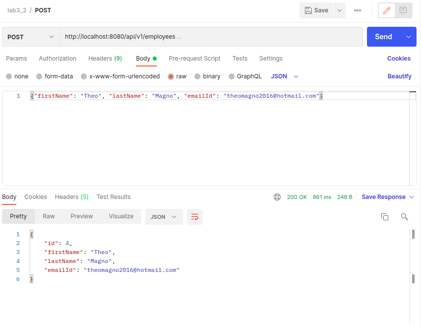
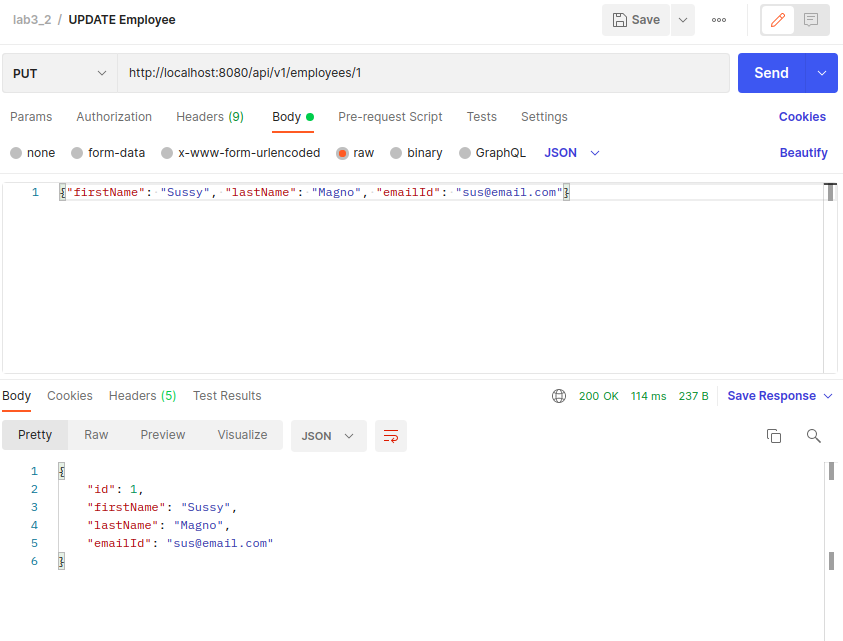
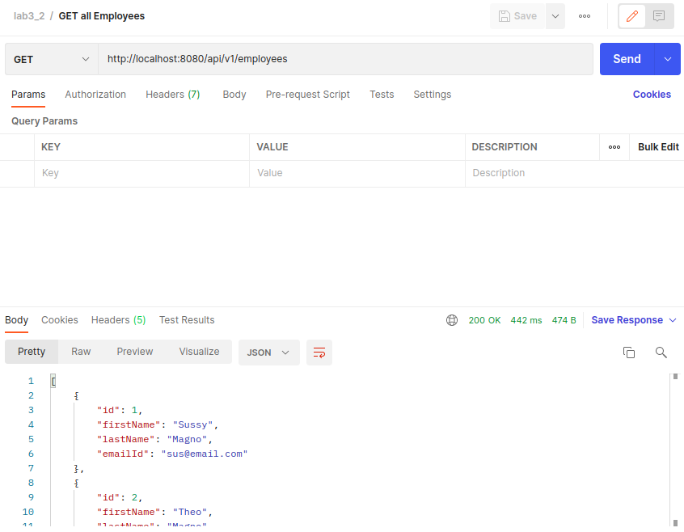
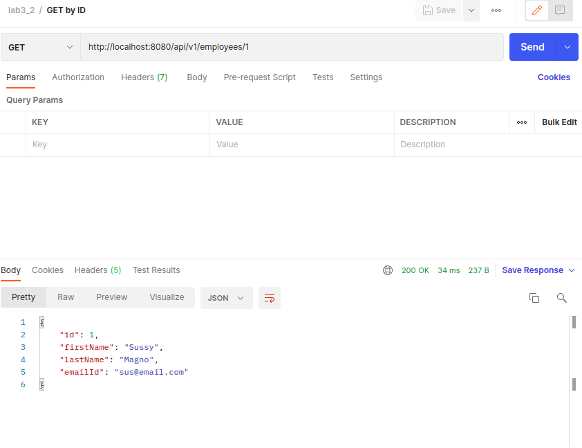
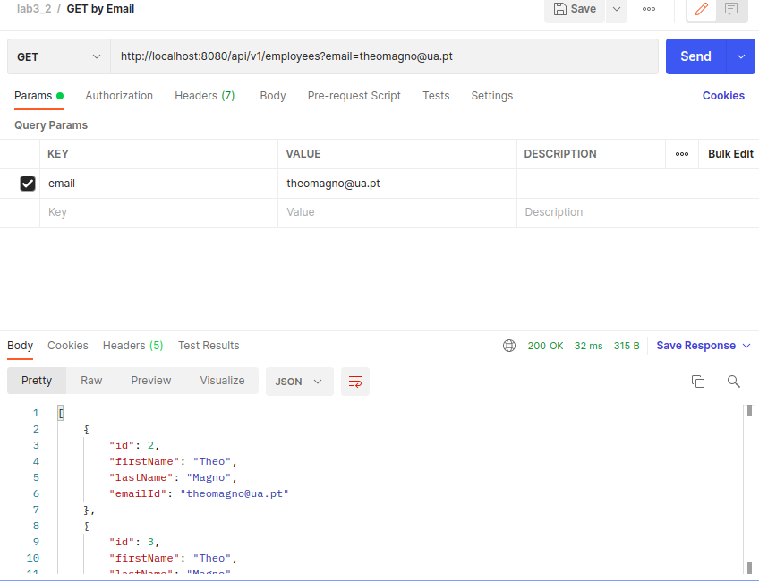
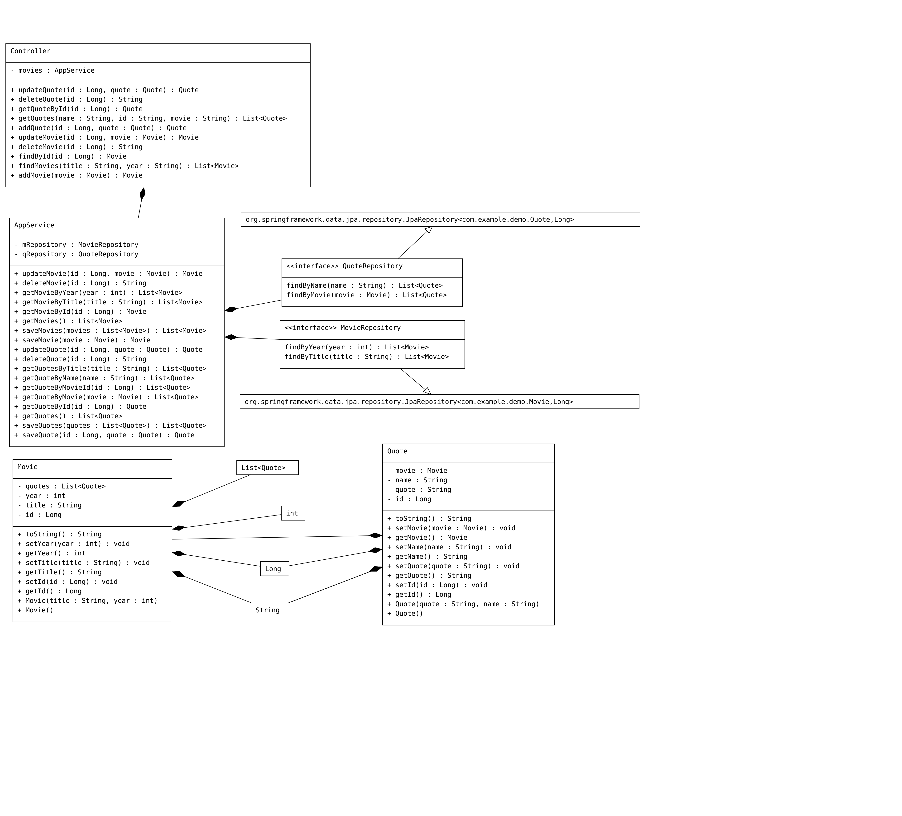

## 3_1

- The userRepository is instantiated because of the *@AutoWired* anotation, that calls automatically its constructor.
- Methods:
    - findAll();
    - save();
    - findById();
    - delete();
    This methods are defined in the superclass CrudRepository;
- The data is being stored at the program in running time, so if the program stops the data is lost.
- The email address is defined as "not empty" with the *@NotBlank* annotation.

## 3_2

### POST METHOD:

### UPDATE METHOD:

### GET ALL METHOD:

### GET BY ID METHOD:

### GET BY EMAIL METHOD:

## 3_3

## REVIEW QUESTIONS

- A) The RestController includes the Controller and ResponseBody annotations. So, the RestController automatically serializes the the return object into the HttpResponse while in the Controller it is needed to include the ResponseBody to be able to do that.
- B) 
- C) These annotations are used to communicate with the MySQL Database. @Table indicates that this entity will be a table in the database; @Column indicates that the attribute will be a column from the table; @Id is usually used to create an incremental unique ID for each row at the database.
- D) The @AutoWired annotation calls the constructor to instantly create an instance of a class so that the program can run rightly.